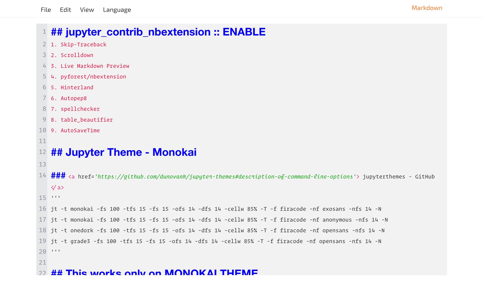

# Jupyter Notebook Theme - Jupyterthemes

## Prerequisites
You need to install the `jupyterthemes` package from `pip` or `pip3`.
```bash
## Check your requirements
pip install jupyterthemes
pip3 install jupyterthemes
```
Then Install the Jupyter Notebook Theme:
```bash
## Dark Theme > Ocean16
jt -t oceans16 -fs 100 -tfs 16 -fs 16 -ofs 16 -dfs 16 -cellw 85% -T -f firacode -nf exosans -nfs 16 -N

## Light Theme > Grade3
jt -t grade3 -fs 100 -tfs 16 -fs 16 -ofs 16 -dfs 16 -cellw 85% -T -f firacode -nf exosans -nfs 16 -N

## Monokai Theme
jt -t monokai -fs 100 -tfs 16 -fs 16 -ofs 16 -dfs 16 -cellw 85% -T -f firacode -nf exosans -nfs 16 -N
```

Install my theme via clicking this link: [Jupyter Notebook Theme by arv-anshul](https://userstyles.world/style/6625/jupyter-notebook-default).
<hr>

# Some Theme Images
### Light theme > Grade3




### Dark theme > Ocean16


## Install Stylus Extension
### [For Firefox](https://addons.mozilla.org/en-US/firefox/addon/styl-us/)

### [For Chrome](https://chrome.google.com/webstore/detail/stylus/clngdbkpkpeebahjckkjfobafhncgmne)

# Thank You !! :blush: